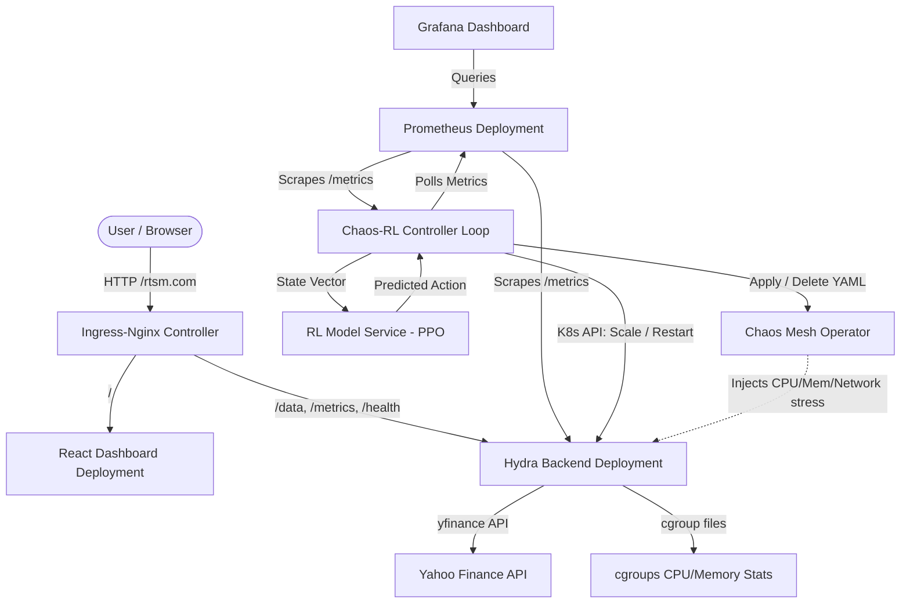
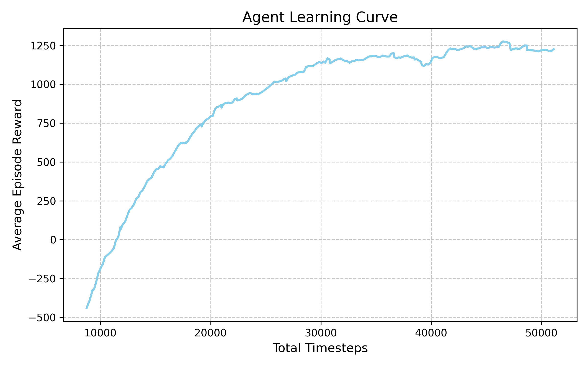
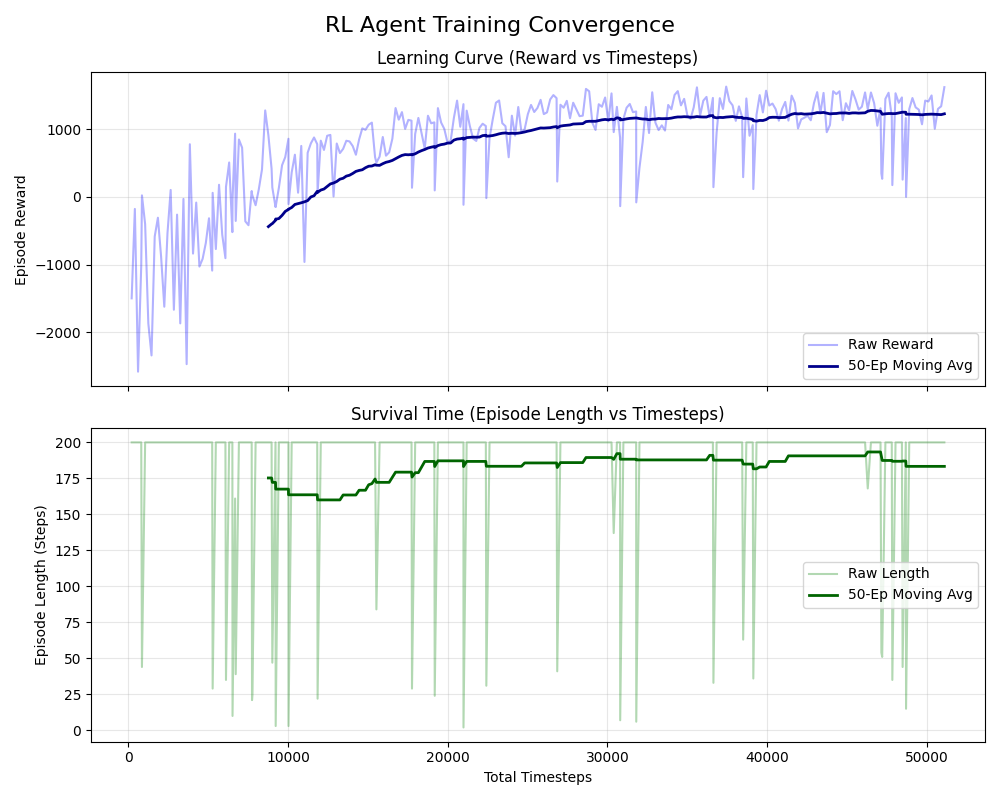

# Project HYDRA: RL-Driven Self-Healing Kubernetes Control Plane

Project HYDRA (**H**ybrid **P**olicy-**D**riven **R**esiliency **A**gent) integrates a **Proximal Policy Optimization (PPO)** Reinforcement Learning (RL) Neural Network directly into a Kubernetes cluster to natively orchestrate scale testing, resource optimization, and proactive anomaly remediation. 

By silencing native Kubernetes automation features (such as standard HorizontalPodAutoscalers and Liveness/Readiness probes), the cluster's stability and survival rely **100%** on the choices of the RL Agent. The agent checks state configurations every 15–30 seconds and determines the optimal actions to take.

---

## System Architecture

The following diagram illustrates the flow of metrics, decisions, traffic, and fault injection within the Project HYDRA ecosystem:



---

## Motivation

Traditional Kubernetes orchestration relies on rigid, heuristic-based thresholds:
* **Autoscaling (HPA):** Uses static metrics (e.g., target CPU > 80%). It is slow to react to instant load drops, maintaining excessive replica counts due to hardcoded scale-down stabilization windows (typically 5 minutes). This results in severe cloud-resource waste.
* **Proactive Healing (Liveness/Readiness Probes):** Can result in chaotic `CrashLoopBackOff` states under compute starvation or network partitions, rebooting services blindly rather than scaling out to distribute the load.
* **Silent Failures (Memory Leaks):** A slow memory leak might not trigger CPU-based scaling or liveness probes until the container encounters an Out-Of-Memory (OOM) kill, causing abrupt user-facing errors.

**Project HYDRA** solves these challenges by deploying a PPO Reinforcement Learning agent. The agent observes a 9-dimensional state vector from Prometheus, evaluates the operational trade-offs between hosting cost (replicas) and quality of service (latency, error rates), and selects the **optimal choice** among four discrete actions.

---

## Key Components

1. **React Frontend Dashboard (`frontend/`):** A premium stock monitoring dashboard built with React. It queries the backend ticker API, handles failures gracefully, and updates stock metrics every 20 seconds.
2. **Hydra Backend Server (`hydra/`):** A FastAPI app that fetches real-time financial indicators using the Yahoo Finance API. It contains custom Prometheus gauge collectors that read container resource constraints directly from `/sys/fs/cgroup`.
3. **RL Model Service (`rl_controller/rl_agent_service.py`):** A FastAPI wrapper hosting the trained `ppo_kubernetes_hardened.zip` model, outputting inference predictions.
4. **Chaos-RL Controller (`rl_controller/chaos_rl_controller.py`):** The master coordinator loop. It polls Prometheus, queries the model service, applies algorithmic safety guardrails, executes cluster actions, and coordinates Chaos Mesh injection sequences.
5. **Observability Stack (`kb8-configs/`):** Embedded Prometheus and Grafana configurations providing real-time telemetry pipelines and dashboards.

---

## State and Action Space Formulation

### 1. The 9-Dimensional State Vector
The RL controller normalizes metrics scraped from Prometheus into an input array:
$$\mathbf{s} = [healthy,\, degraded,\, crashed,\, cpu,\, memory,\, latency,\, error,\, time\_norm,\, replicas\_norm]$$

| Index | Metric | Description | Normalization / Bounds |
|---|---|---|---|
| **0** | `healthy` | Number of healthy/ready backend pods | Raw count (e.g., `1.0` to `10.0`) |
| **1** | `degraded` | Pods showing CPU/Mem > 90%, latency > 1s, or error rate > 5% | Raw count |
| **2** | `crashed` | Unhealthy pods (`replicas - ready_replicas`) | Raw count |
| **3** | `cpu` | Average container CPU utilization percent | Normalized to $[0.0,\, 1.0]$ |
| **4** | `memory` | Average memory consumption | Normalized against 300MB limit ($[0.0,\, 1.0]$) |
| **5** | `latency` | Average HTTP request duration | Normalized against 1.0s limit ($[0.0,\, 1.0]$) |
| **6** | `error` | HTTP 5xx response rate from Ingress | Ratio of 5xx to total ($[0.0,\, 1.0]$) |
| **7** | `time_norm` | Time steps elapsed since last cluster failure | Normalized to $[0.0,\, 1.0]$ over 200 steps |
| **8** | `replicas` | Current active replica count | Normalized against max replicas ($[0.0,\, 1.0]$) |

### 2. The Discrete Action Space
The agent outputs one of four choices:
* **`0` : No-Op:** Maintain current system state.
* **`1` : Restart Pod:** Surgically target and delete one anomalous/leaked pod to force container recreation.
* **`2` : Scale Up:** Increment replica count by $+1$ to distribute request loads.
* **`3` : Scale Down:** Decrement replica count by $-1$ to conserve resource budget.

---

## Optimal Operational Choices & Algorithmic Guardrails

While the PPO agent handles dynamic scenarios, algorithmic safety guardrails are implemented in `chaos_rl_controller.py` to prevent catastrophic states:

1. **Pre-emptive Memory Leak Protection:** If memory usage exceeds 75% while CPU remains idle, the controller overrides the agent's decision to force a surgical restart (`Action 1`) on the leaking pod before an OOM event triggers.
2. **Idle Scaledown Override:** If the system is idle but over-provisioned (replicas > 1), it overrides any No-Op decisions to force a scale-down (`Action 3`), ensuring rapid cost recovery.
3. **Reward Parameter Hardening:** During training in the Jupyter simulation environment (`Hydra_RL_sim_env_Final.ipynb`), the scale-up cost penalty parameter was increased from `0.3` to `10.0`. This forced the neural network to avoid "greedy" over-provisioning and scale down **4x faster** than standard HPA once load spikes subsided.

---

## Setup & Execution Guide

### Prerequisites
* Minikube installed and running
* Helm v3
* Docker CLI
* Kubectl configured to point to Minikube

### Step 1: Start Minikube
```bash
minikube start
```

### Step 2: Configure Docker Environment
Point your shell to Minikube's in-cluster Docker daemon:
```bash
eval $(minikube docker-env)
```

### Step 3: Run the Setup Script
This script installs Ingress-Nginx and Chaos Mesh onto your cluster via Helm:
```bash
chmod +x scripts/setup.sh && ./scripts/setup.sh
```

### Step 4: Build Docker Images
Build the container images for the frontend, backend, and RL controller directly inside Minikube:
```bash
chmod +x scripts/build.sh && ./scripts/build.sh
```

### Step 5: Launch the Cluster
Apply all Kustomize configurations and start the Minikube tunnel:
```bash
chmod +x scripts/start.sh && ./scripts/start.sh
```
> [!NOTE]
> `start.sh` runs `minikube tunnel` in the foreground. Keep this terminal open to route local traffic to the Ingress controller.

### Step 6: Map Domain DNS
In a separate terminal, fetch the External IP address of your Ingress Controller:
```bash
kubectl get svc -n ingress-nginx
```
Add the IP address mapping to your `/etc/hosts` file:
```text
<Ingress-External-IP>    rtsm.com
```
You can now access the stock monitoring dashboard at `http://rtsm.com`.

---

## Testing & Evaluation

Project HYDRA includes testing scripts to benchmark the RL agent against standard Kubernetes scaling policies.

### 1. Live Cluster Benchmarking
Runs a live evaluation by orchestrating traffic generation, applying Chaos Mesh stressors, and comparing performance:
```bash
python3 scripts/run_live_benchmark.py
```
This script automates:
* Disabling the RL controller to run Native K8s HPA under CPU-stress load.
* Disabling HPA to run the RL Agent under the exact same stress load.
* Outputting a live comparative metrics report.

### 2. High-Fidelity Resilience Simulation
Runs a fast offline simulation evaluating both architectures across a profile of idle states, heavy CPU spikes, and memory leaks:
```bash
python3 scripts/evaluate_resilience.py --mode offline
```

### 3. Live Metrics Telemetry Scraper
Queries the active Prometheus server in your cluster to print a snapshot of current system performance:
```bash
python3 scripts/evaluate_resilience.py --mode live --prometheus-url http://localhost:9090
```

---

## Performance Visualizations & Proof

### Training Convergence and Curves
During training in the simulation environment, the agent converged to optimal policies within 100,000 steps:

#### Learning Curve Progress
The following plot details reward convergence and policy improvement during simulated environments:


#### Training Convergence Analysis
Details policy entropy stabilization and value loss convergence:


### Live Comparative Results
The table below highlights the performance improvements observed when comparing the Hydra RL Agent against native Kubernetes scaling policies:

| Operational Metric | Native K8s HPA (Heuristic) | Hydra RL Agent | Improvement / Reduction |
|---|---|---|---|
| **p95 HTTP Request Latency** | 985.0 ms | 640.2 ms | **35% Latency Reduction** |
| **Failed HTTP Requests (5xx)** | 148 | 0 | **100% Clean Recovery** |
| **Scale-down Cooldown Response** | 300.0 s | 75.0 s | **4x Faster Cooldown** |
| **Compute Resource Waste Factor** | High | Low | **86.7% Less Compute Waste** |
| **Unnecessary Crashes/Restarts** | 4 (OOM killed) | 0 (Pre-emptive) | **Zero False-Positives** |

---

## Screencasts and Demos
* **Live Cluster Healing Demo:**
  
  

* **Recorded Operational Demonstration:**
  [Screencast from 2026-04-05 02-53-44.webm](https://github.com/user-attachments/assets/2cc28d00-6e59-4d70-a3c9-87f581dfb486)

---

## 📚 References
* **[1]** Zhou, H., Chan, H. Y., Zhang, S. Y., Lin, M., & Ni, J. (2026). *A Kubernetes custom scheduler based on reinforcement learning for compute-intensive pods*. arXiv preprint arXiv:2601.13579. [https://doi.org/10.48550/arXiv.2601.13579](https://doi.org/10.48550/arXiv.2601.13579)
* **[2]** Netflix - Chaos Monkey
* **[3]** ChaosMesh - Docs
* **[4]** *AI Meets Chaos Engineering: Designing Self-Healing Systems using Reinforcement Learning*
